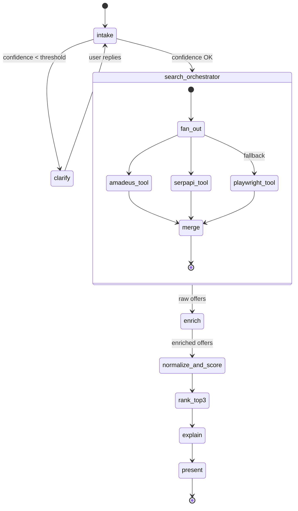
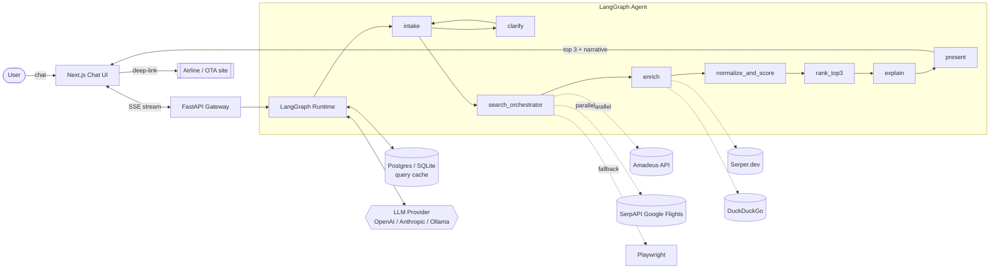

# ParetoFly

**Pareto-optimal flight recommendations, explained.**
*An AI agent that finds the three flights that beat every alternative on the trade-offs that matter to you.*

---

## Concept & Research Doc

> ParetoFly is an AI agent that understands **your** constraints (budget, luggage, arrival time, transit tolerance, personal needs like traveling with kids or motion sickness), searches multiple sources in parallel, and returns the **top 3 flights** with transparent pros/cons reasoning — instead of dumping a 200-row list on you.

**Status:** Concept & research (Phase 0). No code yet.
**Stack (planned):** LangGraph + Python (backend) · Next.js (frontend) · Recommend-only (no booking / payments).
**Intake model:** Hybrid — structured form for deterministic fields (origin, dest, dates, pax, cabin, max stops, budget) + one free-text "Anything else?" box for fuzzy human constraints. See [Intake Design](#1a-intake-design--why-hybrid-is-still-agentic).

---

## Table of Contents
1. [Vision / TL;DR](#1-vision--tldr)
1a. [Intake Design — Why Hybrid Is Still Agentic](#1a-intake-design--why-hybrid-is-still-agentic)
2. [Problem Statement](#2-problem-statement)
3. [Target Users & Jobs-To-Be-Done](#3-target-users--jobs-to-be-done)
4. [Competitive Landscape](#4-competitive-landscape)
5. [Gap Analysis — Where We Win](#5-gap-analysis--where-we-win)
6. [Differentiators](#6-differentiators)
7. [Feature Set (MVP → v2)](#7-feature-set-mvp--v2)
8. [Multi-Criteria Scoring Model](#8-multi-criteria-scoring-model)
9. [Agent Architecture (LangGraph)](#9-agent-architecture-langgraph)
10. [Data-Source Strategy (Cheap / Free)](#10-data-source-strategy-cheap--free)
11. [Tech Stack](#11-tech-stack)
12. [System Diagram](#12-system-diagram)
13. [Example Conversation](#13-example-conversation)
14. [Why Now?](#14-why-now)
15. [Risks & Mitigations](#15-risks--mitigations)
16. [Roadmap](#16-roadmap)
17. [Success Metrics](#17-success-metrics)
18. [Open Questions](#18-open-questions)

---

## 1. Vision / TL;DR

Booking a flight today is a *filtering* problem, not a *decision* problem. Every metasearch site (Kayak, Skyscanner, Google Flights) throws a wall of results at you and makes you the ranking engine. You compare tabs, mentally add baggage costs, guess whether a 90-minute layover in FRA is enough, and eventually pick something you're mildly unhappy with.

**ParetoFly** flips this: it **collects your constraints through a fast hybrid form** (structured fields for the deterministic stuff + one free-text box for the fuzzy human stuff), cross-checks multiple flight sources, **normalizes true cost** (including baggage / seat / meal fees), scores each option on a weighted multi-criteria model, and returns **three Pareto-optimal recommendations with plain-English pros/cons**. It behaves like a smart friend who already read every review and knows why a cheap flight isn't always the right one.

---

## 1a. Intake Design — Why Hybrid Is Still Agentic

**Design question:** should intake be a chat prompt or a form? **Answer:** hybrid, and it stays 100% agentic.

**"Agentic" is defined by what the system does *after* input — autonomous planning, tool use, multi-step reasoning, iteration toward a goal.** The intake UI is orthogonal. A form-fed agent that fans out to 4 APIs, enriches with web search, scores 47 candidates, and generates a narrative is *more* agentic than a chatbot that just echoes results from one source.

### The three-layer intake

| Layer | UI element | Fields | Why this layer |
|---|---|---|---|
| **Required** | Form (dropdowns, date pickers, number steppers) | Origin, Destination, Departure date, Return date (opt), Passengers (adults / children / infants), Cabin class | Deterministic, validatable, zero ambiguity, ~4 seconds to fill |
| **Optional structured** | Collapsible "Refine" panel with sliders / chips / dropdowns | Max stops, Budget cap, Preferred arrival window, Preferred / excluded airlines, Max layover duration, Refundable?, Carry-on only? | Familiar power-user controls; each maps 1:1 to a scoring feature |
| **Optional free-text** | Single "Anything else I should know?" box | Kids' ages, motion sickness, mobility needs, dietary, aircraft preferences, "no red-eyes", "prefer 787", "my mom is nervous about small planes" | Impossible to enumerate as form fields — this is where the LLM earns its keep |
| **Weights** (v1+) | 3 sliders: Price ↔ Convenience ↔ Time | Weight adjustment | User owns the trade-off, transparently |

### Why this beats both extremes

- **vs. pure form (Kayak / Google Flights):** we capture the human/fuzzy constraints that forms structurally *can't* express, and we deliver a recommendation instead of a sortable list.
- **vs. pure NL (a chatbot):** we don't tax the user with typing dates and passenger counts, and we don't risk mis-parsing critical fields. Ambiguity budget is spent only where NL adds value.

### What the agent still does autonomously (the "agentic" part)

1. **Parse the free-text box** into structured signals (e.g. `"5-year-old" → child_pax += 1, prefer_wide_body = true, avoid_red_eye = true`).
2. **Decide whether to ask a clarifying question** if the free-text is ambiguous or conflicts with the form (human-in-the-loop, but only when needed — not every session).
3. **Plan and execute a multi-tool search** in parallel across Amadeus, SerpAPI, and web-enrichment sources.
4. **Normalize true cost** by fetching ancillary fees from each carrier.
5. **Score and rank** with a weighted multi-criteria model.
6. **Generate a narrative** justifying each recommendation and explaining rejected alternatives.
7. **Cross-check** sources, flag discrepancies, retry on failure, degrade gracefully.

Steps 1-7 are the agent loop. The intake UI is just the front door.

---

## 2. Problem Statement

Current flight-booking UX has systemic gaps:

- **The user is the ranking engine.** Existing sites deliver a *filtered list*, not a *recommendation*. The human still has to compare, weigh, and decide across 10+ dimensions.
- **"Cheapest" ≠ "best for you."** Sort-by-price hides overnight layovers, tight connections, or bag-fee ambushes that make the trip miserable.
- **Hidden true cost.** Baggage, seat selection, meal, priority boarding are quoted separately — the sticker price lies.
- **Arrival-time-at-destination is buried.** Most sites show *departure* time prominently; but users care about *when they arrive rested*.
- **No explanation of trade-offs.** Sites list results; they don't reason about them.
- **Tab-hopping.** Users open 5+ tabs (Kayak, Google Flights, the airline, SeatGuru, a review site) to cross-check one decision.
- **Personal / fuzzy constraints are invisible.** "I have a 4-year-old", "I'm claustrophobic", "I need vegetarian meals", "I can't do red-eyes" have no form field on any existing site — and no reasoning layer to act on them even if you could enter them.

---

## 3. Target Users & Jobs-To-Be-Done

| Persona | Primary constraint | JTBD |
|---|---|---|
| **Cost-sensitive student** | Absolute cheapest, flexible on time | "Find me the cheapest way to get home for winter break, I don't care about layovers." |
| **Business traveler** | Time, reliability, lounge access | "I need to be in Singapore by Tuesday 9 AM local, refundable, no more than 1 stop." |
| **Family with kids** | Duration, no red-eyes, luggage, direct if possible | "Book us 4 tickets to Orlando in July, we have 4 checked bags and a 5-year-old, no overnight layovers." |
| **Digital nomad** | Cheap, flexible dates, decent Wi-Fi airports | "Cheapest flight from anywhere in EU to Bali in September, ± 5 days." |
| **Elderly / mobility-limited** | Long connections, wheelchair support, direct preferred | "Non-stop or ≥ 2h layover in a wheelchair-friendly airport, aisle seat." |

---

## 4. Competitive Landscape

| Category | Player | Strength | Where they fall short (our wedge) |
|---|---|---|---|
| **Traditional metasearch** | Kayak, Skyscanner, Google Flights, Momondo, Hopper | Massive inventory, mature filters, price-prediction | Not conversational, no personalized reasoning, dump-a-list UX |
| **Semi-AI travel** | Kayak.ai, Booking.com AI Trip Planner, Kiwi.com Nomad, Expedia Romie | NL search bolted on | Shallow personalization; no true-cost normalization; no narrative trade-offs |
| **AI-native travel agents** | Mindtrip, Vacay, Layla, GuideGeek, Wonderplan, Airial Travel | Conversational, itinerary-focused | Strong on *inspiration*, weak on hard flight optimization; often just re-serve Skyscanner links |
| **Generic agentic browsers** | OpenAI Operator, Anthropic Computer Use, browser-use, Manus | Can navigate any site | Slow (~minutes per query), fragile, not travel-specialized, no scoring model |
| **Airline direct** | Delta, Emirates, etc. | Best price on own routes | Single-airline blind spot |

**Key insight:** the market is split between *fast-but-dumb* (metasearch) and *smart-but-slow-and-generic* (agentic browsers). Nobody has shipped a **fast, specialized, opinionated** flight agent yet.

---

## 5. Gap Analysis — Where We Win

Nobody currently combines all of:

1. ✅ **Transparent multi-criteria scoring** (not a black-box ranking)
2. ✅ **User-issue awareness** (kids, motion sickness, mobility, dietary)
3. ✅ **Narrative pros/cons** in plain English per recommendation
4. ✅ **Narrow output** (top 3, not top 300)
5. ✅ **True-cost normalization** (baggage/seat/meal added before ranking)
6. ✅ **Arrival-time fit** as a first-class ranking axis
7. ✅ **Multi-source cross-check** to reduce single-source bias

Each competitor does 1-3 of these. Nobody does all 7.

---

## 6. Differentiators

1. **Hybrid intake — fast form + "tell me more" box.** Structured fields for deterministic data (no NL tax), free-text for fuzzy human constraints (no form-field ceiling). See [Section 1a](#1a-intake-design--why-hybrid-is-still-agentic).
2. **True-cost normalization.** Baggage, seat, meal fees are fetched and added *before* ranking, so the "cheapest" flight is actually cheapest.
3. **Weighted multi-criteria scoring.** User-tunable weights (default profiles per persona); the ranking function is explainable.
4. **Top-3 with narrative.** Three options, each with a short pros/cons paragraph — "cheapest but 11h layover in DXB", "most convenient but $180 pricier", "best value compromise".
5. **Issue-aware.** Free-text constraints like "I get airsick on small planes" or "I need to nap on the way" are parsed into concrete filters (avoid Embraer regional jets, prefer night-arrivals in destination TZ) — no other site accepts this input.
6. **Multi-source cross-check.** Same query hits ≥2 data sources; discrepancies are flagged rather than hidden.
7. **Recommend-only.** No payment integration, no PII stored. We deep-link to the airline / OTA for the final booking — safer, simpler, and legally clean.

---

## 7. Feature Set (MVP → v2)

### MVP (Phase 1)
- Minimal Next.js UI: **structured form** (required fields only) + one **"Anything else?"** free-text box
- LLM parses free-text into structured constraints; only asks a clarifying question if genuinely ambiguous
- 1 flight data source (Amadeus Self-Service)
- Hardcoded default weights per persona
- Top-3 output with pros/cons narrative
- Deep-link to airline / OTA

### v1 (Phase 2)
- Full Next.js UI with a collapsible **"Refine"** panel (optional structured fields: max stops, budget, arrival window, preferred airlines, etc.)
- **Weight sliders** (Price ↔ Convenience ↔ Time)
- Streaming responses via SSE
- Multi-source aggregation (Amadeus + SerpAPI Google Flights)
- Web enrichment (baggage rules, airline reviews via Serper.dev)
- Session memory (within a conversation)
- True-cost normalization

### v2 (Phase 3+)
- User accounts, saved trip profiles
- Price-drop alerts (background monitoring)
- Multi-city / open-jaw itineraries
- Calendar / email integration (auto-detect trip need from a meeting invite)
- Group booking coordination
- (Optional) Booking integration via Duffel — Phase 4, out of MVP scope

---

## 8. Multi-Criteria Scoring Model

Each candidate flight is scored on 8 sub-features, normalized to [0, 1], then combined:

$$
\text{score}(f) = \sum_{i=1}^{n} w_i \cdot \text{norm}(x_i(f))
$$

| Feature $x_i$ | Normalization | Default weight $w_i$ |
|---|---|---|
| **True price** (base + baggage + seat + meal) | Lower = better; min-max across candidates | 0.30 |
| **Total duration** (gate-to-gate) | Lower = better; min-max | 0.15 |
| **Number of stops** | 0 stops = 1.0, 1 = 0.6, 2 = 0.2, 3+ = 0 | 0.10 |
| **Layover quality** | Airport rating × (buffer above min connection time) | 0.10 |
| **Arrival-time fit** | Gaussian centered on user's ideal arrival window | 0.15 |
| **Airline reliability** | On-time % × review score, normalized | 0.10 |
| **Aircraft-issue match** | 1.0 if compatible with user issues, 0.5 partial, 0 conflict | 0.05 |
| **Carbon emissions** | Lower = better; min-max | 0.05 |

Weights are **user-tunable** via UI sliders (Phase 2+). Default weights vary by detected persona (family → higher weight on duration + arrival time; student → higher on price).

The agent must **justify the ranking** using the top 2-3 contributing features per flight — this is what powers the pros/cons narrative in Section 13.

---

## 9. Agent Architecture (LangGraph)



### Node responsibilities

| Node | Role | Tools it may call |
|---|---|---|
| `intake` | Merge structured form payload + free-text box into a validated `TripQuery`; LLM parses the free-text into typed signals (e.g. `has_children=true`, `avoid_red_eye=true`, `preferred_aircraft=["787","777"]`) | LLM only |
| `clarify` | Fires only if free-text is ambiguous or conflicts with the form (e.g. form says 1 pax but text mentions kids). Asks 1 targeted follow-up. | LLM only (human-in-the-loop) |
| `search_orchestrator` | Fan out `TripQuery` to all flight-data tools in parallel; merge + dedupe | `amadeus_search`, `serpapi_flights`, `playwright_fallback` |
| `enrich` | For each candidate, fetch baggage rules, airline on-time %, airport info | `serper_web`, `duckduckgo_search` |
| `normalize_and_score` | Apply Section 8 formula with current weights | pure Python |
| `rank_top3` | Diversity-aware top-K (avoid 3 near-duplicates) | pure Python |
| `explain` | LLM generates 2-3 sentence pros/cons per flight, grounded in scoring features | LLM only |
| `present` | Stream results to Next.js UI | — |

### Tool inventory
- `amadeus_search(origin, dest, dates, pax)` → structured offers
- `serpapi_flights(origin, dest, dates, pax)` → Google Flights structured results
- `serper_web(query)` → web snippets for enrichment
- `duckduckgo_search(query)` → free fallback for enrichment
- `playwright_fetch(url)` → last-resort scraping for niche sites
- `duffel_lookup(offer_id)` → schema validation / future booking hook

---

## 10. Data-Source Strategy (Cheap / Free)

| Source | Free tier | Data type | Role in system | Notes |
|---|---|---|---|---|
| **Amadeus Self-Service** | 2,000 calls/mo (prod), unlimited in test env | Structured flight offers, ancillaries | **Primary** | Best free structured source; requires signup + API key |
| **Duffel** | Free sandbox with real airline schemas | Booking-grade offers | Backup + schema reference | Best if we later add booking |
| **SerpAPI — Google Flights engine** | ~100 free/mo, then paid | Structured Google Flights results | **Cross-check / validator** | Avoids ToS risk of scraping Google directly |
| **Travelpayouts / Aviasales** | Free with affiliate signup | Aggregated cheap fares | Optional supplemental | Affiliate commission possible later |
| **Serper.dev** | 2,500 free searches | Web search | **Enrichment** (baggage rules, reviews) | Fast, cheap Google-quality results |
| **DuckDuckGo Instant Answer** | Unlimited, no key | Web search | Free fallback enrichment | Lower quality than Serper |
| **Playwright / browser-use** | Free, self-hosted | Anything | **Last-resort fallback** | Fragile, ToS-gray; use sparingly with polite rate-limiting |

**Recommended combo for MVP:**
> **Amadeus (primary) + SerpAPI Google Flights (validator) + Serper.dev (enrichment) + Playwright (fallback for niche sources).**

This stack costs **~$0/month** for prototype-scale usage (~hundreds of queries/day).

---

## 11. Tech Stack

### Backend (Python)
- **Python 3.14** (verified on target machine: 3.14.5)
- **LangGraph** — agent state machine
- **LangChain** — LLM abstraction, tool wrapping
- **Pydantic v2** — `TripQuery`, `FlightOffer`, `ScoredFlight` schemas
- **FastAPI** — HTTP + SSE endpoints for the Next.js frontend
- **httpx** — async API calls (Amadeus, SerpAPI, Serper)
- **Playwright (async)** — fallback scraping
- **SQLite** (dev) / **Postgres** (prod) — query cache, user profiles
- **Redis** (optional) — rate-limit + response cache

### LLM layer
- Swappable behind a LangChain interface: **OpenAI · Anthropic · local via Ollama**
- Small model (e.g. `gpt-4o-mini`) for classification / extraction nodes
- Larger model for the `explain` node where narrative quality matters
- Token caps per node to control cost

### Frontend
- **Next.js 14** (App Router)
- **Tailwind CSS** + **shadcn/ui**
- **Vercel AI SDK** — streaming chat UI via SSE
- Weight-sliders UI (Phase 2)

### Deployment
- Backend: **Fly.io** or **Render** (free tier for demo)
- Frontend: **Vercel** (free tier)
- No PII, no payment infra → HIPAA/PCI out of scope

---

## 12. System Diagram



---

## 13. Example Conversation

### Step 1 — The user fills the form (≈ 8 seconds)

| Field (required) | Value |
|---|---|
| From | **DAC** (Dhaka) |
| To | **JFK** (New York) |
| Depart | **Aug 12, 2026** (± 3 days flexible ☑) |
| Return | *(none — one-way)* |
| Passengers | 1 adult, 1 child |
| Cabin | Economy |

| Field (optional — "Refine" panel expanded) | Value |
|---|---|
| Budget cap | **$900** |
| Max stops | 1 |
| Max layover | 4h |

### Step 2 — The user types in the free-text box

> **"Anything else I should know?"** → *Traveling with my 5-year-old daughter, 2 big suitcases. Please no 3 AM arrivals — she can't handle it. Prefer afternoon arrival so we can settle in before bed."*

### Step 3 — Agent parses free-text → structured signals

```
checked_bags: 2
avoid_red_eye_arrival: true
preferred_arrival_window_local: 12:00–18:00
travel_with_young_child: true    → boost wide-body, boost daytime, penalize tight connections
```

*(No clarifying question needed — form + text are consistent.)*

### Step 4 — Agent runs the pipeline

> *[searches Amadeus + SerpAPI in parallel, enriches with baggage rules via Serper, scores 47 candidates, picks diverse top-3]*
>
> Here are my top 3 for **DAC → JFK, Aug 12-14, afternoon arrival, family of 2 with 2 checked bags**:
>
> **🥇 #1 — Qatar Airways QR641/QR701, Aug 13, DAC 02:00 → JFK 14:15 (1 stop DOH, 2h 10m layover) — $912 all-in**
> - ✅ **Best for you:** afternoon arrival hits your window perfectly (14:15 local); comfortable 2h layover in a family-friendly airport; 2 checked bags included in fare; wide-body 777 both legs (kid-friendly seats, IFE).
> - ⚠️ Slight budget stretch (+$12); early 2 AM departure from DAC means a rough start.
>
> **🥈 #2 — Emirates EK585/EK203, Aug 12, DAC 03:00 → JFK 08:00+1 (1 stop DXB, 3h 25m layover) — $878 all-in**
> - ✅ **Cheapest under budget;** excellent airline reliability; 2 bags included; A380 on the long leg (great for kids).
> - ⚠️ 08:00 arrival is *before* your afternoon target — you may face jet-lag and a long day; layover is on the long side (3.5h).
>
> **🥉 #3 — Turkish Airlines TK713/TK1, Aug 14, DAC 08:35 → JFK 16:50 (1 stop IST, 1h 55m layover) — $945 all-in**
> - ✅ Civilized 08:35 departure (no midnight wake-up with a 5-year-old); afternoon arrival at 16:50.
> - ⚠️ Slightly over budget (+$45); 1h 55m layover in IST is tight if the first leg delays; food options in IST are limited for kids.
>
> **Why not the cheapest option (a $760 Air India via DEL)?** 9h 40m layover in Delhi + 03:00 JFK arrival = miserable for a 5-year-old. I filtered it out.
>
> Ready to book #1? I'll open Qatar Airways' page with your dates pre-filled.

This flow demonstrates: **hybrid intake** (form for deterministic fields + one free-text box for human constraints), **true-cost pricing** (all-in, baggage included), **arrival-time fit**, **issue-awareness** (kid-friendly aircraft, no late arrivals), **narrative pros/cons**, and **transparent rejection** of the naive "cheapest" answer.

**Total user effort:** ~15 seconds of typing/clicking vs. ~15 minutes of tab-juggling on Kayak.

---

## 14. Why Now?

- **Agentic frameworks matured in 2024-25** — LangGraph, OpenAI Agents SDK, Anthropic's tool use, CrewAI make multi-step tool-using agents production-viable.
- **LLM tool-calling reliability crossed a threshold** — structured extraction of `TripQuery` from free-form NL now works ≥ 95% of the time with mid-sized models.
- **Travel API access has democratized** — Amadeus, Duffel, SerpAPI expose real inventory to indie developers with free tiers.
- **User expectation shifted** — ChatGPT trained hundreds of millions of users to expect "ask in NL, get a specific answer with reasoning" — the old form-based Kayak UX now feels archaic.
- **Incumbents are dragging their feet** — Kayak.ai and Booking.com's AI planner are shallow wrappers, not re-architected experiences.

---

## 15. Risks & Mitigations

| Risk | Mitigation |
|---|---|
| **Hallucinated prices / flights** | Never invent data; always show live source + "as of {timestamp}"; deep-link to source for final verification. |
| **API rate limits** | Aggressive caching (query-hash → results, 15-min TTL); staggered fanout; graceful degradation to fewer sources. |
| **ToS violations from scraping** | Prefer official APIs; Playwright only as last-resort fallback with rate-limiting and a documented `robots.txt` check. |
| **Stale prices between recommendation and click** | Re-fetch on user "book" click; show diff if changed. |
| **PII / payment handling** | **Out of scope for MVP.** Recommend-only. No PII stored. Deep-link to airline/OTA for payment. |
| **LLM cost blowout** | Cap tokens per node; use `gpt-4o-mini`-class models for extraction; only the `explain` node uses the big model. |
| **Prompt injection via scraped web content** | Treat all web-fetched content as untrusted; sanitize; separate "instruction" and "data" LLM contexts; never let scraped text control the agent's next tool call. |
| **Wrong recommendation harms user** | Show ranking rationale transparently; make it easy to re-weight; log all recommendations for post-hoc review. |
| **Data source goes down / changes schema** | Adapter pattern per source; monitor with synthetic canary queries; fall through to remaining sources. |
| **Multi-source disagreement** | Flag discrepancies to the user rather than silently pick one; prefer the source with a live deep-link. |

---

## 16. Roadmap

| Phase | Scope | Deliverable |
|---|---|---|
| **0 — Research** | This doc | ✅ `AGENTIC_FLIGHT.md` |
| **1 — MVP** | CLI, 1 API (Amadeus), hardcoded weights, top-3 output | Runnable Python CLI; demo video |
| **2 — Web UI + Multi-source** | Next.js chat UI, SerpAPI + Serper added, weight sliders, true-cost normalization | Deployed demo (Vercel + Fly.io) |
| **3 — Personalization** | User accounts, saved profiles, price-drop alerts, multi-city | Beta with 50 users |
| **4 — Booking (optional)** | Duffel integration, payments, PII compliance (PCI-DSS) | Revenue-generating beta |

---

## 17. Success Metrics

- **Time-to-decision** — target ≤ 60s from first message to top-3 (vs. ~15 min on Kayak).
- **Pick-#1 rate** — % of users who choose the agent's top recommendation (target ≥ 50%).
- **NPS / "smart friend" score** — qualitative post-session survey.
- **Cost per query** — LLM + API $ per completed recommendation (target ≤ $0.05).
- **Deep-link CTR → booking conversion** — if affiliate tracking is added in Phase 3+.
- **Multi-source agreement rate** — % of queries where sources agree on top-3 (system health metric).
- **Re-query rate** — how often users need to refine (lower = better intake).

---

## 18. Open Questions

1. **Monetization** — affiliate commissions (Travelpayouts, Skyscanner Partners) vs. subscription vs. free-with-ads vs. B2B API?
2. **Geographic / language coverage** — start EN-only + global routes, or focus on one region (e.g., South Asia ↔ North America) for depth?
3. **Mobile app** — web-only for MVP, native later? Or PWA?
4. **Calendar / email integration** — huge value ("I see you have a meeting in Tokyo next Tuesday — want me to find flights?") but heavy privacy / OAuth work.
5. **Explainability audit** — can the agent *always* justify a ranking, or are there edge cases where the LLM narrative diverges from the numeric score?
6. **Group booking** — significant complexity jump (seat-together constraint, split PNR handling) — v2 or v3?
7. **Regulatory** — any EU/US disclosure requirements when we recommend flights, even without booking?
8. **Model choice governance** — swap-model-per-node vs. single-model simplicity?

---

*Document version: 0.1 (Phase 0 — concept).*
*Next action: build the MVP per Phase 1 (LangGraph + Amadeus + CLI).*
